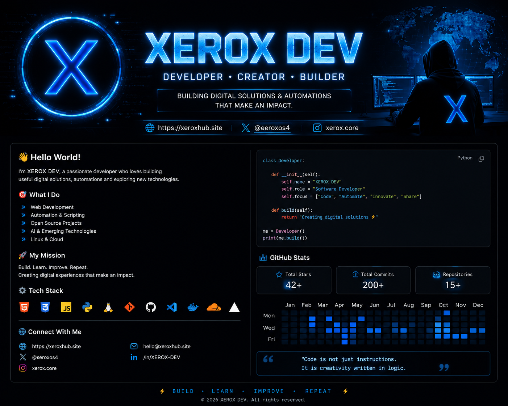

<div align="center">



<br>

# ⚡ XEROX DEV

### Developer • Creator • Builder

**Building digital solutions, automation systems & future technologies**

🌐 https://xeroxhub.site

</div>

---

# 👋 Hello World!

```python
class Developer:

    def __init__(self):
        self.name = "XEROX DEV"
        self.username = "xeroxos"
        self.role = "Software Developer"
        self.focus = [
            "Web Development",
            "Automation",
            "AI Technologies",
            "Open Source"
        ]

    def build(self):
        return "Creating digital solutions ⚡"


me = Developer()
print(me.build())
<div align="center">


</div>

## ⚡ Latest Activity

- 🔨 Building XeroxHub
- 🤖 Experimenting with automation
- 🌐 Exploring modern web technologies
